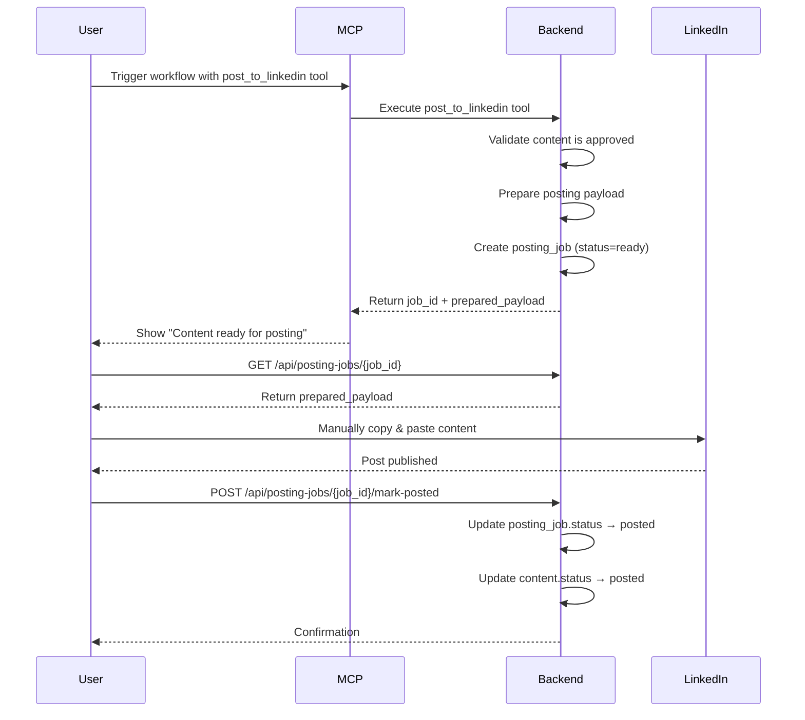

# 🚀 Posting & Distribution Phase

## Overview

The **Posting & Distribution Phase** enables safe, user-controlled publishing of approved content to LinkedIn while keeping MCP as the orchestration backbone. This design avoids violating LinkedIn's Terms of Service by never posting directly from the backend—instead, MCP prepares content and the user manually completes the posting action.

## 🎯 Core Principles

1. **Backend never posts directly to LinkedIn** - No API calls, no automation
2. **User must remain in control** - Final posting is manual
3. **MCP orchestrates** - Workflow prepares and tracks posting intent
4. **Content must be approved** - Only approved content can be prepared for posting
5. **Platform-agnostic design** - Architecture supports future platforms

---

## 🏗️ Architecture

### Database Schema

#### `posting_jobs` Table

Represents the **intent to post**, not the act itself.

```sql
CREATE TABLE posting_jobs (
    id UUID PRIMARY KEY,
    workspace_id UUID NOT NULL REFERENCES workspaces(id),
    content_id UUID NOT NULL REFERENCES content(id),
    platform VARCHAR(50) NOT NULL,              -- 'linkedin', 'twitter', etc.
    status VARCHAR(50) NOT NULL DEFAULT 'ready', -- 'ready', 'awaiting_user', 'posted', 'failed'
    prepared_payload JSONB NOT NULL,             -- Final post data (caption, hashtags, images)
    error_message TEXT,                          -- Error details if failed
    retry_count INTEGER NOT NULL DEFAULT 0,      -- Number of retry attempts
    created_at TIMESTAMPTZ NOT NULL DEFAULT NOW(),
    posted_at TIMESTAMPTZ,                       -- When user confirmed posting
    CONSTRAINT unique_content_posting_job UNIQUE (content_id)
);
```

**Key Constraints:**
- One content → zero or one posting_job (enforced by unique constraint)
- posting_job is created by MCP tool execution
- CASCADE delete when workspace/content is deleted

**Status Flow:**
```
ready → posted (success)
ready → failed → ready (retry)
```

---

## 🛠️ MCP Tool: `post_to_linkedin`

### Purpose

The `post_to_linkedin` tool is an **MCP orchestration tool** that prepares content for posting. It does NOT actually post to LinkedIn.

### What It Does

1. **Validates preconditions:**
   - Content exists in database
   - Content status is `approved`
   - Content belongs to the correct workspace

2. **Prepares final payload:**
   - Extracts caption text
   - Formats hashtags
   - Includes image URLs (if available)
   - Adds LinkedIn-specific formatting hints

3. **Creates posting_job:**
   - Status: `ready`
   - Stores prepared payload in database
   - Links to content and workspace

4. **Returns result:**
   - Job ID
   - Prepared payload for user review

### What It Does NOT Do

❌ No LinkedIn API calls  
❌ No browser automation  
❌ No scheduled posting (yet)  
❌ No direct publishing

### Tool Configuration

```json
{
  "content_id": "uuid-of-approved-content",
  "workspace_id": "uuid-of-workspace"
}
```

### Example Response

```json
{
  "status": "success",
  "tool": "post_to_linkedin",
  "result": {
    "job_id": "550e8400-e29b-41d4-a716-446655440000",
    "content_id": "123e4567-e89b-12d3-a456-426614174000",
    "status": "ready",
    "prepared_payload": {
      "content_id": "123e4567-e89b-12d3-a456-426614174000",
      "platform": "linkedin",
      "post_text": "🚀 Exciting news about AI in marketing!\n\nDiscover how AI is transforming content creation...\n\n#AI #Marketing #ContentCreation",
      "hashtags": ["#AI", "#Marketing", "#ContentCreation"],
      "image_url": "https://s3.amazonaws.com/bucket/image.png",
      "formatting_hints": {
        "max_length": 3000,
        "supports_markdown": false,
        "supports_images": true
      },
      "created_at": "2025-12-26T10:30:00Z"
    },
    "message": "Content prepared for LinkedIn posting. User must manually post."
  }
}
```

---

## 📡 API Endpoints

### 1. Get Posting Job

**GET** `/api/posting-jobs/{job_id}`

Retrieve a specific posting job with prepared payload.

**Response:**
```json
{
  "id": "uuid",
  "workspace_id": "uuid",
  "content_id": "uuid",
  "platform": "linkedin",
  "status": "ready",
  "prepared_payload": { /* ... */ },
  "error_message": null,
  "retry_count": 0,
  "created_at": "2025-12-26T10:30:00Z",
  "posted_at": null
}
```

---

### 2. List Ready Jobs

**GET** `/api/posting-jobs/workspace/{workspace_id}/ready`

List all posting jobs with status `ready` for a workspace.

**Query Parameters:**
- `limit` (optional, default: 50) - Max number of jobs to return

**Response:**
```json
[
  {
    "id": "uuid",
    "workspace_id": "uuid",
    "content_id": "uuid",
    "platform": "linkedin",
    "status": "ready",
    "prepared_payload": { /* ... */ },
    "created_at": "2025-12-26T10:30:00Z"
  }
]
```

---

### 3. List All Jobs

**GET** `/api/posting-jobs/workspace/{workspace_id}/all`

List all posting jobs for a workspace with optional filtering.

**Query Parameters:**
- `status_filter` (optional) - Filter by status: `ready`, `posted`, `failed`
- `limit` (optional, default: 100) - Max number of jobs to return

---

### 4. Mark Job as Posted

**POST** `/api/posting-jobs/{job_id}/mark-posted`

Mark a posting job as `posted` after user manually posts to LinkedIn.

**What It Does:**
1. Updates `posting_job.status` → `posted`
2. Sets `posting_job.posted_at` timestamp
3. Updates linked `content.status` → `posted`
4. Sets `content.posted_at` timestamp

**Response:**
```json
{
  "id": "uuid",
  "status": "posted",
  "posted_at": "2025-12-26T11:00:00Z",
  /* ... */
}
```

---

### 5. Mark Job as Failed

**POST** `/api/posting-jobs/{job_id}/mark-failed`

Mark a posting job as `failed` if user encounters errors.

**Request Body:**
```json
{
  "error_message": "LinkedIn rejected the post due to character limit"
}
```

**What It Does:**
1. Updates `posting_job.status` → `failed`
2. Sets `error_message`
3. Increments `retry_count`

---

### 6. Retry Failed Job

**POST** `/api/posting-jobs/{job_id}/retry`

Reset a failed posting job back to `ready` status.

**Response:**
```json
{
  "id": "uuid",
  "status": "ready",
  "error_message": null,
  "retry_count": 1
}
```

---

## 🔄 User Workflow

### Step-by-Step Process



### Example: Publishing a Caption to LinkedIn

#### 1️⃣ Create Workflow with Posting Step

```json
{
  "workspace_id": "uuid",
  "name": "LinkedIn Caption + Post",
  "target_platform": "linkedin",
  "steps": [
    {
      "order": 1,
      "name": "Generate Caption",
      "tool_name": "caption_generator",
      "config": {
        "topic": "AI in Marketing",
        "platform": "linkedin",
        "tone": "professional"
      }
    },
    {
      "order": 2,
      "name": "Prepare for LinkedIn",
      "tool_name": "post_to_linkedin",
      "config": {
        "content_id": "{{step_1.content_id}}",
        "workspace_id": "uuid"
      }
    }
  ]
}
```

#### 2️⃣ Execute Workflow

**POST** `/api/workflows/{workflow_id}/run`

- Step 1: Generates caption → creates `content` with status `draft`
- User approves content → updates status to `approved`
- Step 2: Executes `post_to_linkedin` → creates `posting_job` with status `ready`

#### 3️⃣ Retrieve Prepared Content

**GET** `/api/posting-jobs/workspace/{workspace_id}/ready`

Returns:
```json
[
  {
    "id": "job-uuid",
    "content_id": "content-uuid",
    "platform": "linkedin",
    "status": "ready",
    "prepared_payload": {
      "post_text": "🚀 AI is revolutionizing marketing!\n\n#AI #Marketing",
      "image_url": "https://...",
      "formatting_hints": {
        "max_length": 3000
      }
    }
  }
]
```

#### 4️⃣ User Posts to LinkedIn

1. Copy `post_text` from `prepared_payload`
2. Open LinkedIn
3. Create new post
4. Paste content
5. Add image (if `image_url` exists)
6. Click "Post"

#### 5️⃣ Confirm Posting

**POST** `/api/posting-jobs/{job_id}/mark-posted`

- Updates `posting_job.status` → `posted`
- Updates `content.status` → `posted`
- Sets timestamps

---

## 🧪 Testing

### Test Script: `test_posting_phase.py`

```python
import requests
import json

BASE_URL = "http://localhost:3000/api"
WORKSPACE_ID = "your-workspace-uuid"
CONTENT_ID = "your-approved-content-uuid"

def test_post_to_linkedin_tool():
    """Test the post_to_linkedin MCP tool"""
    # This would be called via workflow execution
    # For testing, directly call tool_registry
    pass

def test_list_ready_jobs():
    """Test listing ready posting jobs"""
    response = requests.get(f"{BASE_URL}/posting-jobs/workspace/{WORKSPACE_ID}/ready")
    assert response.status_code == 200
    jobs = response.json()
    print(f"✅ Found {len(jobs)} ready jobs")
    return jobs

def test_get_posting_job(job_id):
    """Test retrieving a specific posting job"""
    response = requests.get(f"{BASE_URL}/posting-jobs/{job_id}")
    assert response.status_code == 200
    job = response.json()
    print(f"✅ Retrieved job: {job['id']}")
    print(f"Payload: {json.dumps(job['prepared_payload'], indent=2)}")
    return job

def test_mark_posted(job_id):
    """Test marking a job as posted"""
    response = requests.post(f"{BASE_URL}/posting-jobs/{job_id}/mark-posted")
    assert response.status_code == 200
    job = response.json()
    assert job['status'] == 'posted'
    print(f"✅ Job marked as posted at {job['posted_at']}")

def test_mark_failed(job_id):
    """Test marking a job as failed"""
    response = requests.post(
        f"{BASE_URL}/posting-jobs/{job_id}/mark-failed",
        params={"error_message": "Test error"}
    )
    assert response.status_code == 200
    job = response.json()
    assert job['status'] == 'failed'
    print(f"✅ Job marked as failed with error: {job['error_message']}")

def test_retry_job(job_id):
    """Test retrying a failed job"""
    response = requests.post(f"{BASE_URL}/posting-jobs/{job_id}/retry")
    assert response.status_code == 200
    job = response.json()
    assert job['status'] == 'ready'
    print(f"✅ Job reset to ready (retry count: {job['retry_count']})")

if __name__ == "__main__":
    print("🧪 Testing Posting Phase...")
    
    # List ready jobs
    jobs = test_list_ready_jobs()
    
    if jobs:
        job_id = jobs[0]['id']
        
        # Get specific job
        test_get_posting_job(job_id)
        
        # Mark as posted
        test_mark_posted(job_id)
    else:
        print("⚠️ No ready jobs found. Create a workflow with post_to_linkedin tool first.")
```

---

## 🔮 Future Enhancements

### Phase 2 (Future)

1. **Scheduled Posting**
   - Add `scheduled_for` field to `posting_jobs`
   - Background cron job to notify users when scheduled time arrives
   - User still posts manually, but gets reminders

2. **Multi-Platform Support**
   - Add `post_to_twitter` tool
   - Add `post_to_facebook` tool
   - Platform-specific payload formatting

3. **OAuth Integration (Optional)**
   - Connect social accounts with OAuth
   - Store tokens securely
   - Enable one-click posting (if ToS allows)

4. **Analytics Integration**
   - After posting, user can manually input post URL
   - Backend fetches engagement metrics via platform APIs
   - Store in `analytics` table

5. **Template Library**
   - Save successful post formats as templates
   - Reuse templates for future content
   - A/B test different formats

---

## 📝 Summary

| Component | Purpose | Key Feature |
|-----------|---------|-------------|
| **posting_jobs table** | Track posting intent | One-to-one with content |
| **post_to_linkedin tool** | Prepare content for posting | No direct LinkedIn API calls |
| **Posting Router** | API endpoints for job management | List, retrieve, mark posted/failed |
| **User Workflow** | Manual posting process | Copy payload → Post to LinkedIn → Confirm |
| **Content Lifecycle** | Status tracking | draft → approved → posted |

---

## ✅ Implementation Checklist

- [x] Create `posting_jobs` table migration
- [x] Add `PostingStatus` enum and `POSTING_JOBS_TABLE` constant
- [x] Add `PostingJob` schemas (Create, Update, Response)
- [x] Register `post_to_linkedin` tool in `tool_registry.py`
- [x] Create `app/routers/posting.py` with all endpoints
- [x] Register posting router in `main.py`
- [x] Document usage in `README_POSTING_PHASE.md`

---

## 🚀 Getting Started

### 1. Apply Migration

Run the SQL migration in Supabase SQL Editor:

```bash
cat migrations/003_add_posting_jobs.sql | pbcopy
# Paste into Supabase SQL Editor and execute
```

### 2. Restart Backend

```bash
cd backend-python
python main.py
```

### 3. Create a Workflow

Use the existing workflow API to create a workflow with `post_to_linkedin` tool:

```bash
POST /api/workflows
{
  "workspace_id": "uuid",
  "name": "Content + Posting",
  "steps": [
    { "order": 1, "tool_name": "caption_generator", "config": {...} },
    { "order": 2, "tool_name": "post_to_linkedin", "config": {"content_id": "{{step_1.content_id}}", "workspace_id": "uuid"} }
  ]
}
```

### 4. Execute & Monitor

1. Run workflow: `POST /api/workflows/{id}/run`
2. Approve content: `POST /api/content/{id}/approve`
3. List ready jobs: `GET /api/posting-jobs/workspace/{id}/ready`
4. Get prepared payload: `GET /api/posting-jobs/{job_id}`
5. Post to LinkedIn manually
6. Confirm: `POST /api/posting-jobs/{job_id}/mark-posted`

---

**🎯 Mission Complete:** The Posting & Distribution Phase is now fully implemented with user-controlled, ToS-compliant LinkedIn posting! 🚀
